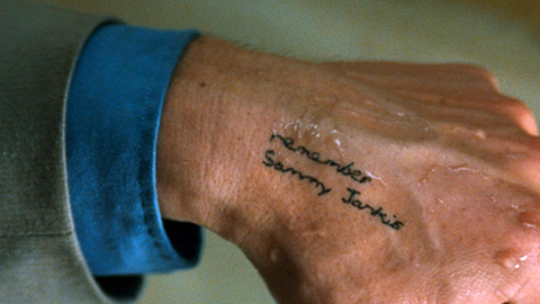

% Real World Reflex
% Doug Beardsley
% Takt

## Audience

- People with prior reflex knowledge
- Interested in design patterns for larger apps

## My Experience

Two production reflex apps

- 02/2015 - 12/2015: 14,000 lines (Soostone)
- 10/2016 - present: 21,000 lines (Takt)

Misc small projects

- hsnippet.com
- github.com/reflex-frp/reflex-dom-contrib
- github.com/reflex-frp/reflex-dom-ace
- github.com/reflex-frp/reflex-dom-semui
- github.com/TaktInc/reflex-dhtmlx

## Goal

- Overall, building UIs with Reflex is fantastic.
- This talk describes some less obvious things encountered while building real world app.

## Outline

- The API
- Existence and Maybe
- Widget Patterns
- FRP Frames
- Causality Loops

## You will forget this

I've given this talk to multiple people as onboarding and they all came back
with questions later that were answered here.

## Come back to it

> - Don't feel bad

## Note on code examples

Correct type signature

    foo :: MonadWidget t m => Dynamic t Foo -> m (Event t ())

In this presentation

    foo ::  Dynamic Foo -> m (Event ())

# The API

## Event, Behavior, Dynamic

> - Event - Notifies you when something occurs (push)
> - Behavior - Has a value at EVERY point in time (pull)
> - Dynamic - Gives you both

Hard to know when to use which type

## The Big Question

When to use each one?

- If you need to know when something happens...use Event
- If you need to be able to get a value at arbitrary points in time...use Behavior
- If you need to see something's value at arbitrary times AND know when it changes...use Dynamic

## It really is exactly that

## Yes, but that doesn't help

- DOM API is primarily push-oriented
- How would you implement `dynText :: Dynamic Text -> m ()`?
- Need to know when it changes
- Need to be able to query the value in case you have to redraw
- Dynamic is usually preferred over Behavior

## Event and Behavior

    never :: Event a
    hold :: a -> Event a -> m (Behavior a)
    tag :: Behavior a -> Event b -> Event a
    attach :: Behavior a -> Event b -> Event (a,b)
    attachWith :: (a -> b -> c) -> Behavior a -> Event b -> Event c
    switch :: Behavior (Event a) -> Event a

## Dynamic

Accessors

    current :: Dynamic a -> Behavior a
    updated :: Dynamic a -> Event a

Construction

    constDyn :: a -> Dynamic a
    holdDyn :: a -> Event a -> m (Dynamic a)
    foldDyn :: (a -> b -> b) -> b -> Event a -> m (Dynamic b)

## Dynamic 2

    tagDyn :: Dynamic a -> Event b -> Event a
    attachDyn :: Dynamic a -> Event b -> Event (a,b)
    attachDynWith :: (a -> b -> c) -> Dynamic a -> Event b -> Event c

## Instances

<table>
<tr><th></th><th>Functor</th><th>Applicative</th><th>Monad</th></tr>
<tr><th>Event</th><td>X</td><td></td><td></td></tr>
<tr><th>Behavior</th><td>X</td><td>X</td><td>X</td></tr>
<tr><th>Dynamic</th><td>X</td><td>X</td><td>X</td></tr>
</table>

> - `T.pack . show <$> anEvent`
> - `() <$ anEvent`

# Existence and Maybe

## Must have a value, but don't have one?

    hold    :: a -> Event a -> m (Behavior a)
    holdDyn :: a -> Event a -> m (Dynamic a)

## Use the adjunction!
### (a Maybe)

> - `s/a/Maybe a/`
> - How do you go the other way?
> - `maybe`, `fromMaybe`, etc
> - We have one more tool:

## Use the adjunction!
### (a Maybe)

    fmapMaybe    :: (a -> Maybe b) -> Event a         -> Event b
    fmapMaybe id ::                   Event (Maybe a) -> Event b
  
# Widget Patterns

## textErr

How to write?

    textErr :: Either Text Text -> m ()

## textErr

    textErr :: Either Text Text -> m ()
    textErr (Left err) = elClass "span" "red-text" $ text err
    textErr (Right t) = text t

## dynTextErr

> - How to write?
> - dynTextErr :: Dynamic (Either Text Text) -> m ()
> - Can't pattern match

## Higher-order FRP

> - Reflex has two core higher-order functions:
> - widgetHold :: m a -> Event (m a) -> m (Dynamic a)
> - dyn :: Dynamic (m a) -> m (Event a)

## Nested Reactive Values

|  Outer   |  Inner   | Collapsing Function |
|----------|----------|---|
| Dynamic  | Dynamic  | <input type="text"/> |
| Dynamic  | Behavior | <input type="text"/> |
| Dynamic  | Event    | <input type="text"/> |
| Behavior | Dynamic  | <input type="text"/> |
| Behavior | Behavior | <input type="text"/> |
| Behavior | Event    | <input type="text"/> |
| Event    | Dynamic  | <input type="text"/> |
| Event    | Behavior | <input type="text"/> |
| Event    | Event    | <input type="text"/> |

## Nested Reactive Values

|  Outer   |  Inner   | Collapsing Function |
|----------|----------|---|
| Dynamic  | Dynamic  | join |
| Dynamic  | Behavior | join . current |
| Dynamic  | Event    | switch . current, switchPromptlyDyn |
| Behavior | Dynamic  | join . fmap current |
| Behavior | Behavior | join |
| Behavior | Event    | switch |
| Event    | Dynamic  | join . holdDyn iv |
| Event    | Behavior | join . hold iv |
| Event    | Event    | switch . hold iv, switchPromptly, switchPromptOnly |

## Input Widgets

"Definitive" widget

    widget :: a -> Event a -> m (Dynamic a)

View Widgets

    widget :: Dynamic a -> m (Event a)

# FRP Frames

## Frames

- A frame is the atomic time unit
    - Frame begins with, say, a mouse click
    - Mouse click event fires
    - Events fmapped from that event fire
    - All other events depending on those events fire
    - Repeat until there are no more event firings
    - Frame ends

## Frames and Dynamics

    current :: Dynamic a -> Behavior a
    updated :: Dynamic a -> Event a

> - `updated` gets the new value from the firing event
> - `current` gets the value from the previous frame
> - `uniqDyn` supresses the firing if nothing changed

# Causality Loops

## Recursive Do

    tweetWidget = do
        click <- button "Send Tweet"
        ta <- textArea $ def & setValue .~ ("" <$ click)
        ...

vs

    tweetWidget = do
        rec ta <- textArea $ def & setValue .~ ("" <$ click)
            click <- button "Send Tweet"
        ...

## Loops

    loopWidget = do
        rec click <- button "Add"
            val <- formWidget a
            let a = leftmost [42 <$ click, updated val]
            
##

##

- They don't happen very often
- But when they do, it's hard to know how to debug them.

## Loop Symptoms

- App just hangs
- Hangs and consumes 100% CPU
- Throws bizarre error message
    - "heightBagRemove: Height 20 not present in bag HeightBag..."
    - "Causality loop found"
    - something else?

## Finding Loops 1

- Loops can only happen in recursive structures.
- In practice, this is almost always a `rec` block.
- So keep them as small as possible.

## Minimizing the rec

    loopWidget = do
        rec click <- button "Add"
            val <- formWidget a
            let a = leftmost [42 <$ click, updated val]

vs
            
    loopWidget = do
        click <- button "Add"
        rec val <- formWidget a
            let a = leftmost [42 <$ click, updated val]
            
## Finding Loops 2

- Loops can only happen in a `rec` block, so keep them as small as possible
- Disable whole blocks of code

## Substitutions 1

For

    m ()
    
Replace with

    return ()

## Substitutions 2

For

    m (Event a)
    
Replace with

    return never

## Substitutions 3

For

    m (Dynamic (Maybe a))
    
Replace with

    return (constDyn Nothing)

## Finding Loops 3

- Loops can only happen in a `rec` block, so keep them as small as possible
- Disable whole blocks of code
- Binary search

## Binary Search

    val <- case ty of
             InputChar     -> charWidget
             InputString   -> stringWidget
             InputInt      -> intWidget
             InputDouble   -> doubleWidget
             InputDate     -> dateWidget
             InputTime     -> timeWidget
             InputDateTime -> dateTimeWidget
             InputEnum     -> enumWidget

## Binary Search

    val <- case ty of
    --         InputChar     -> charWidget
    --         InputString   -> stringWidget
    --         InputInt      -> intWidget
    --         InputDouble   -> doubleWidget
             InputDate     -> dateWidget
             InputTime     -> timeWidget
             InputDateTime -> dateTimeWidget
             InputEnum     -> enumWidget

## Binary Search

    val <- case ty of
             InputChar     -> charWidget
             InputString   -> stringWidget
             InputInt      -> intWidget
             InputDouble   -> doubleWidget
    --         InputDate     -> dateWidget
    --         InputTime     -> timeWidget
    --         InputDateTime -> dateTimeWidget
    --         InputEnum     -> enumWidget

## Binary Search

    val <- case ty of
    --         InputChar     -> charWidget
    --         InputString   -> stringWidget
    --         InputInt      -> intWidget
    --         InputDouble   -> doubleWidget
    --         InputDate     -> dateWidget
    --         InputTime     -> timeWidget
             InputDateTime -> dateTimeWidget
             InputEnum     -> enumWidget

## Binary Search

    val <- case ty of
    --         InputChar     -> charWidget
    --         InputString   -> stringWidget
    --         InputInt      -> intWidget
    --         InputDouble   -> doubleWidget
    --         InputDate     -> dateWidget
    --         InputTime     -> timeWidget
    --         InputDateTime -> dateTimeWidget
             InputEnum     -> enumWidget

## Fixing Loops

> - Use `current`
> - Avoid using "promptly" functions unless you know you need them

## Fixing Loops: current

Two examples I've actually encountered

    attachPromptlyDynWith func d e
    attachWith func (current d) e

and

    tagPromptlyDyn d e
    tag (current d) e

## Fixing Loops

> - Use `current`
> - Use input widget "change" events instead of `value`
> - Things must be sufficiently lazy
>     - Only pass Event, Behavior, and Dynamic up a rec
>     - Don't passs, e.g. (Event, Event)

# Recap

##

- Reflex is the most enjoyable UI development experience I've encountered.
- Hopefully these tips will help you get up and running more quickly.

## Questions?

https://github.com/mightybyte/real-world-reflex

doug@takt.com

Looking for a job?  Takt is hiring!

